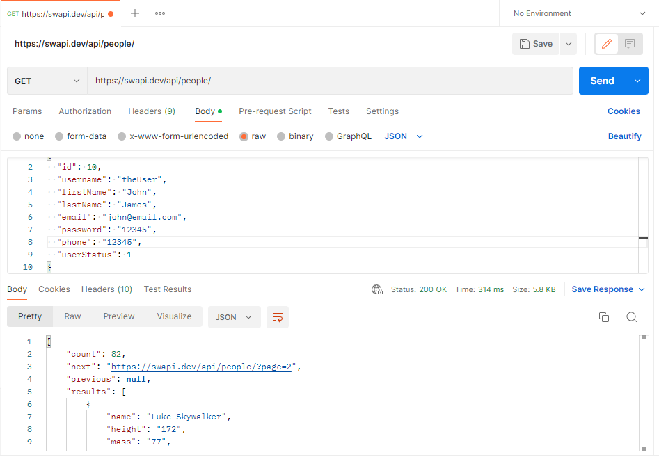
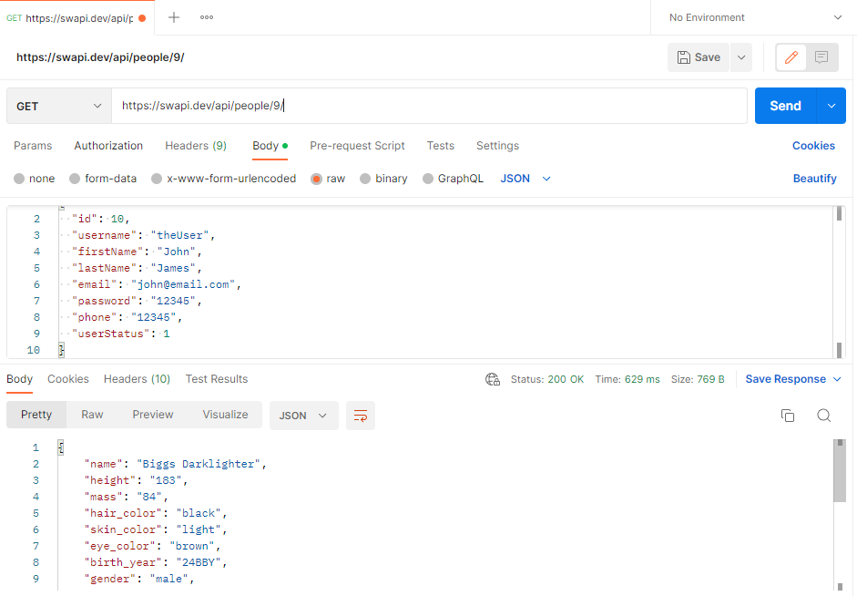

# Star Wars API Documentation

### **API Overview**

Welcome to the Star Wars API documentation. In this documentation, we help you in knowing the resources available and how to use them by using the HTTP requests.

If you are searching of a native helper library then scroll down the bar to check out what is available. Read the getting started section before you start developing the API documentation. Most of your queries will resolve before you complete the getting start section.

In this API, we can fetch all persons in the Star Wars Universe, and individual person information.

#### **Getting Started**

Let’s make our first API request to the Star Wars API!

Open up a terminal and use postman to make an API request for a resource. In the example stated below, we are trying to get the first planet, Tatooine:

https://swapi.dev/api/planets/1/

We use Postman to test our examples as it displays the responses very nicely and gives an overall useful information.

**Responses we get:**

```
   {
     "name": "Tatooine",
    "rotation_period": "23",
    "orbital_period": "304",
    "diameter": "10465",
    "climate": "arid",
    "gravity": "1 standard",
    "terrain": "desert",
    "surface_water": "1",
    "population": "200000",
    "residents": [
        "https://swapi.dev/api/people/1/",
        "https://swapi.dev/api/people/2/",
        "https://swapi.dev/api/people/4/",
        "https://swapi.dev/api/people/6/",
        "https://swapi.dev/api/people/7/",
        "https://swapi.dev/api/people/8/",
        "https://swapi.dev/api/people/9/",
        "https://swapi.dev/api/people/11/",
        "https://swapi.dev/api/people/43/",
        "https://swapi.dev/api/people/62/"
    ],
    "films": [
        "https://swapi.dev/api/films/1/",
        "https://swapi.dev/api/films/3/",
        "https://swapi.dev/api/films/4/",
        "https://swapi.dev/api/films/5/",
        "https://swapi.dev/api/films/6/"
    ],
    "created": "2014-12-09T13:50:49.641000Z",
    "edited": "2014-12-20T20:58:18.411000Z",
    "url": "https://swapi.dev/api/planets/1/"
}
```

You may see slightly different responses but don’t panic. It is because more information has been added to swapi since we build this documentation.

#### **Base URL**

The Base URL is the root URL for the entire API, if you ever make a request to swapi and you get back a 404 NOT FOUND response then checks the Base URL first.

**The Base URL for swapi is:**

[https://swapi.dev/api/](https://swapi.dev/api/)

The documentation below assumes you are prepending the Base URL to the endpoints in order to make requests.

#### **Rate limiting**

Swapi has rate limiting to prevent malicious abuse (as if anyone would abuse Star Wars data!) and to make sure our service can handle a potentially large amount of traffic. Rate limiting is done via IP address and is currently limited to 10,000 API request per day. This is enough to request all the data on the website at least ten times over. There should be no reason for hitting the rate limit.

#### **Authentication**

Swapi is a completely open API. No authentication is required to query and get data. It also means that we have limited what you can do to just GET-ing the data. If you find any mistake in the API documentation you can get back to author via email or twitter.

**JSON Schema**

All resources support JSON schema. You can make a request **/api/\<resource>/schema** to fetch the details of that resource. It allows you to programmatically inspect every attribute of that resource and types.

#### **Request Headers**

Request Content Type: application/json

Response Content Type: application/json

**Request Responses**

200 OK - Successful operation

400 - Invalid input

404 - Wrong Base URL

#### **API Reference**

**What does this API do?**

This API creates a person or character within the Star Wars Universe.

**Method:** GET

**Base URL:** [http://swapi.dev/api](http://swapi.dev/api)

**Endpoint:**

/people/ (To get all people details)

/people/:id/ (To get specific individual details)

/people/schema/ (To view the JSON schema)

**Request Headers:**

**Authorization / Authentication:** No Auth

**Content Type:** application/json

**Accept:** application/json

**Table of Parameters**

| Parameters   | Data Type       | Description                                            |
| ------------ | --------------- | ------------------------------------------------------ |
| Id\*         | Integer (int64) | Unique number given to a user                          |
| username\*   | string          | A special name given to a user for easy identification |
| firstname\*  | string          | The user personal name or birth name                   |
| lastname\*   | string          | It is the family name or surname of the user           |
| email\*      | string          | Email id of the user                                   |
| password\*   | string          | Give a password that used for login into the system    |
| phone\*      | string          | It is a mobile number that used to contact the user    |
| userStatus\* | Integer (int64) | Status of the user                                     |

**API Response:**

For all people



For a single user:


