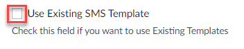

# Vendor Management

### **STANDARD OPERATING PROCEDURE**

**Vendor Management**

**Standard Operating Procedure**

| **Vendor Management** |   |                       |   |
| --------------------- | - | --------------------- | - |
| **Owner**             |   | **Current version**   |   |
| **Created by**        |   | **Date of creation**  |   |
| **Approved by**       |   | **Last updated date** |   |

| **Document Version Management** |                |                 |             |                 |
| ------------------------------- | -------------- | --------------- | ----------- | --------------- |
| **Date of update**              | **Updated by** | **Approved by** | **Version** | **Description** |
|                                 |                |                 |             |                 |
|                                 |                |                 |             |                 |

### Objective:

The objective of this SOP is intended for “Order to Call” to build a vendor database where we can find out the best vendor for the maintenance/renovation works based on their credibility.

### Overview:

Whenever the maintenance department receives calls from the tenants for any issue to be fixed, they have to find the best vendor in terms of “pricing and quality” and send them to the tenant’s location to fix the problem. To find one, we need to have a database where we can find them quickly.

Hence, this SOP is designed to help the “Order to Call” team to build a vendor database where they gather all the necessary parameters of the vendor to decide their credibility. Credibility of the vendor is decided based on the following:

* Availability
* Number of reviews
* Ratings
* Number of years in business
* Affordable pricing
* Communicative
* Reliability
* Honesty

We consider the Average Rating of 4 and above with more reviews as “Good” and below as “Not good”.

Once we have a database, if we receive any maintenance call, we will check our vendor database and will choose the best vendor based on their credibility quickly.

#### Procedure:

1. Go to “[Vendors Module](https://crm.zoho.com/crm/org635091059/tab/Vendors/custom-view/2135217000109583012/list?page=1\&per_page=100)”. You will see a list of vendors and their available details.

_Note: Make sure that “missing info all including availability vendor” is filtered out._

.png>)

1. Click on vendor name. Then, all the details pertaining to that vendor will be displayed under the “Overview” tab.

.png>)

1. Under Vendor Key Info section: “Vendor Notes for Team” - Enter all the information that you acquired in this field.

.png>)

1. To acquire all the required information, follow the below three step process in sequence:

* Send Custom SMS
* Scraping
* Contact vendor

#### Sending a Custom SMS: 

1. Select the drop down next to Add in Order to Call. Then, from the list, select Send Custom SMS button.

Send Email & SMS window appears.

1. Select the checkbox next to “Use Existing SMS Template”.

Once you select the above checkbox, select SMS Title field will be auto-populated.

1. Select SMS Title – Select the required title from the drop down list based on the situation.

Once you select the SMS title, all the fields will be auto-populated as per the in-built existing template.

1. Click on Send Message button.

You will receive all the communication to [vendor@ssgrealestate.com](mailto:vendor@ssgrealestate.com).

1. Write all the received information in “Vendor Notes for Team” field.

#### Scraping: 

1. Search using vendor name on “Google” (example: search “Nelson Contracting Roofing Springfield VA”). All the results of vendor available in Angi, Facebook, and Yelp will be displayed. Google ratings and reviews will be found on the right side.

1. Make a note of the (number of reviews and ratings on Google, Anji, Yelp, and Facebook, Likes and Followers on Facebook).

1. Find out “Areas they serve, services they offer, working hours, number of years they are in business, etc.” on their website-> About page. (Example: [nelsoncontractingservices](https://nelsoncontractingservices.com/about/)).

1. Document all the collected data in “Vendor Notes for Team” field.
2. If you are unable to find any information using the above steps, try to find out using “Contact vendor” method.

#### Contact vendor: 

1. Click on “Call” button to call the vendor

1. During the call, gather information such as speaking person name, availability, Service call rate/hourly rate, Vendor service call pricing and info, what’s included in service call pricing, type of vendor, etc.

_Note:_

* _If the vendor is unable to answer your call, try calling them again after sometime or the next day. Document all the collected data in “Vendor Notes for Team” field. (Example: Called 5 times and there is no response)._
* _If still there is no response, leave a voice message and gather information. If there is a response, write the gathered information in “Vendor Notes for Team”. Otherwise, write that vendor is not communicating._

Ask Vendor Type questions

1. After acquiring all the sufficient data, judge whether the vendor is a preferred vendor or not considering all the credibility parameters:
   * Availability
   * Number of reviews
   * Average rating of 4 and above
   * Number of years in business
   * Affordable pricing
   * Communicative
   * Reliability
   * Honesty
2. Fill all the gathered information in their respective fields.

_Note: Select “IS A PREFERRED VENDOR” checkbox only after carefully examining the vendor._
