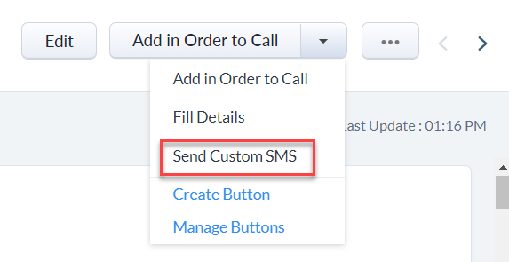
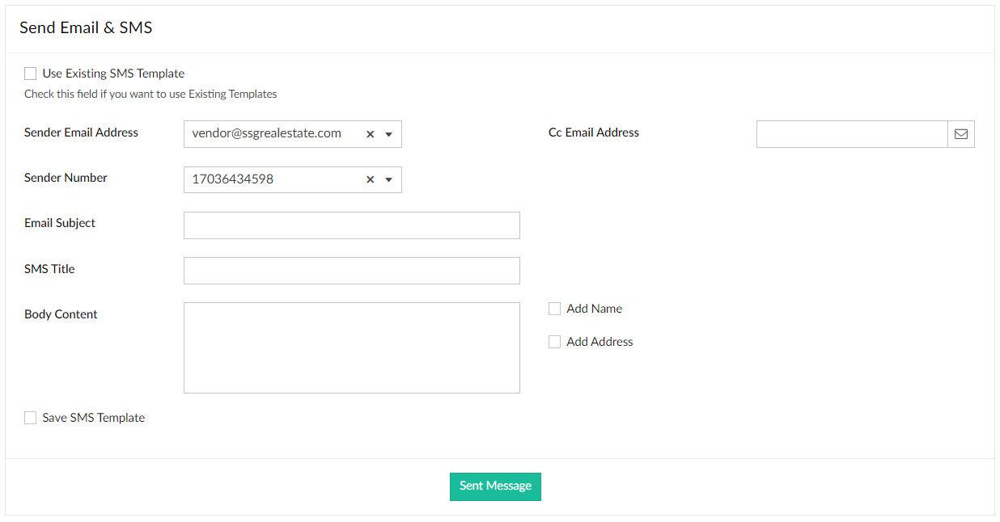
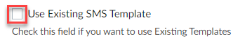
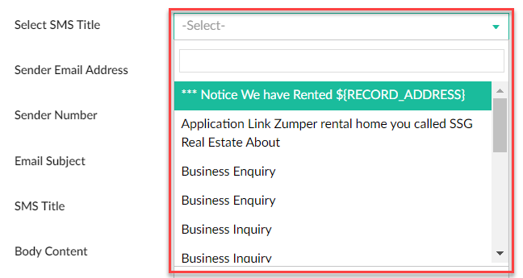
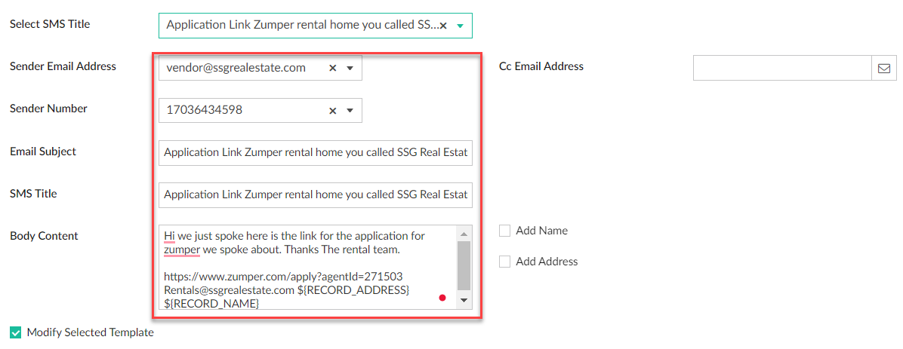
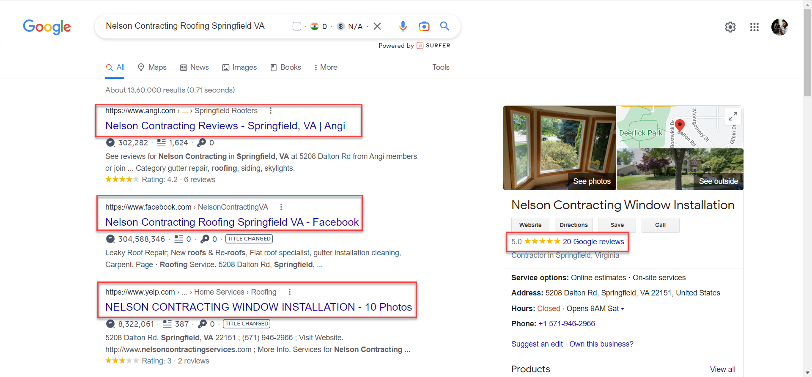
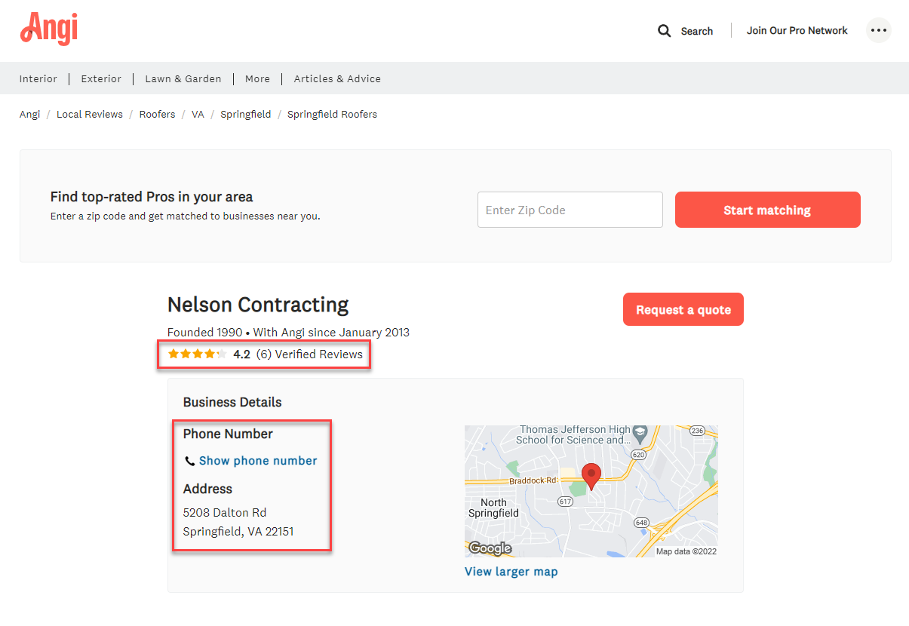
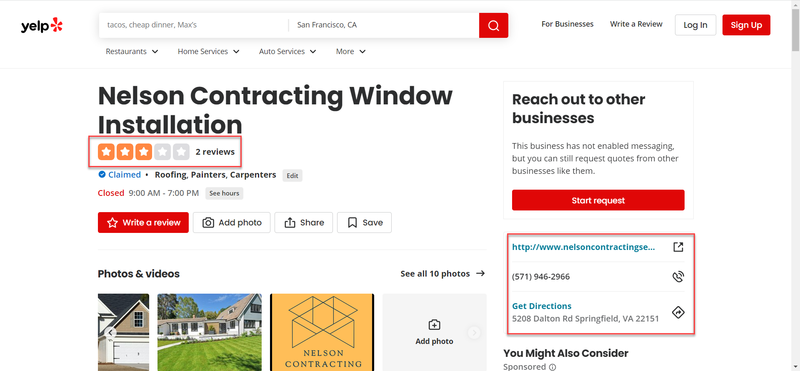
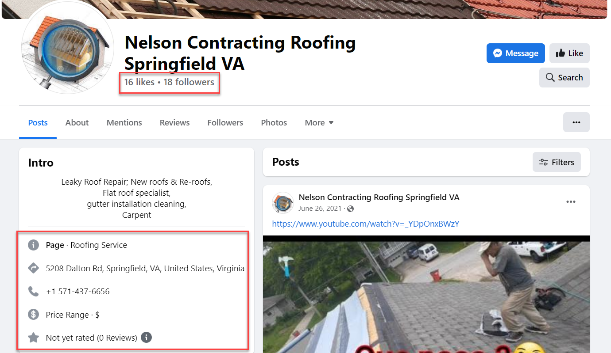
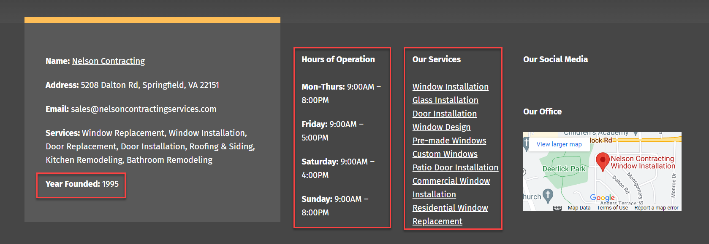

# Vendor Management

### **STANDARD OPERATING PROCEDURE**

**Vendor Management**

**Standard Operating Procedure**

| **Vendor Management** |   |                       |   |
| --------------------- | - | --------------------- | - |
| **Owner**             |   | **Current version**   |   |
| **Created by**        |   | **Date of creation**  |   |
| **Approved by**       |   | **Last updated date** |   |

| **Document Version Management** |                |                 |             |                 |
| ------------------------------- | -------------- | --------------- | ----------- | --------------- |
| **Date of update**              | **Updated by** | **Approved by** | **Version** | **Description** |
|                                 |                |                 |             |                 |
|                                 |                |                 |             |                 |

### Objective

The objective of this SOP is to help the “Order to Call” team build a vendor database that identifies the best vendors for maintenance and renovation work based on credibility.

### Overview

Whenever the maintenance department receives calls from tenants about issues that need to be fixed, they must find the best vendor in terms of pricing and quality and send them to the tenant’s location to resolve the problem. To do this efficiently, we need a database that helps us find vendors quickly.

This SOP is designed to help the “Order to Call” team build a vendor database by gathering the necessary vendor details to evaluate credibility. Vendor credibility is determined based on the following:

* Availability
* Number of reviews
* Ratings
* Number of years in business
* Affordable pricing
* Communicative
* Reliability
* Honesty

We consider an average rating of 4 or above, with more reviews, as “Good.” Anything below that is considered “Not good.”

Once the database is built, we can quickly identify the best vendor for any maintenance call based on credibility.

#### Procedure

1. Go to the [Vendors Module](https://crm.zoho.com/crm/org635091059/tab/Vendors/custom-view/2135217000109583012/list?page=1\&per_page=100). You will see a list of vendors and their available details.

_Note: Make sure that “missing info all including availability vendor” is filtered out._

2. Click the vendor name. All details related to that vendor will be displayed under the **Overview** tab.

3. Under the **Vendor Key Info** section, enter all gathered information in the **Vendor Notes for Team** field.

4. To collect all the required information, follow the three-step process below in sequence:

* Send Custom SMS
* Scraping
* Contact vendor

#### Sending a Custom SMS 

1. Select the drop-down next to **Add in Order to Call**. Then select the **Send Custom SMS** button from the list.

The **Send Email & SMS** window appears.

2. Select the checkbox next to **Use Existing SMS Template**.

Once you select this checkbox, the **SMS Title** field is auto-populated.

3. Select the required title from the **SMS Title** drop-down list based on the situation.

Once you select the SMS title, all fields are auto-populated based on the existing template.

4. Click the **Send Message** button.

All communication will be received at [vendor@ssgrealestate.com](mailto:vendor@ssgrealestate.com).

5. Enter all received information in the **Vendor Notes for Team** field.

#### Scraping 

1. Search for the vendor name on Google. For example, search **Nelson Contracting Roofing Springfield VA**. Results from Angi, Facebook, and Yelp will appear. Google ratings and reviews appear on the right side.

2. Record the number of reviews and ratings on Google, Angi, Yelp, and Facebook, as well as likes and followers on Facebook.

3. Find information such as areas served, services offered, working hours, and number of years in business on the vendor’s website, usually on the **About** page. Example: [nelsoncontractingservices](https://nelsoncontractingservices.com/about/).

4. Document all collected data in the **Vendor Notes for Team** field.
5. If you cannot find enough information using the above steps, use the **Contact Vendor** method.

#### Contact Vendor 

1. Click the **Call** button to contact the vendor.

2. During the call, gather information such as the contact person’s name, availability, service call rate or hourly rate, vendor pricing details, what is included in the service call pricing, and the type of vendor.

_Note:_

* _If the vendor does not answer, call again later or the next day. Document all collected information in the **Vendor Notes for Team** field. Example: Called 5 times and there was no response._
* _If there is still no response, leave a voicemail and continue gathering information. If the vendor responds, record the information in the **Vendor Notes for Team** field. Otherwise, note that the vendor is not communicating._

Ask vendor-type questions.

3. After collecting enough data, determine whether the vendor should be marked as a preferred vendor based on the following credibility parameters:
   * Availability
   * Number of reviews
   * Average rating of 4 and above
   * Number of years in business
   * Affordable pricing
   * Communicative
   * Reliability
   * Honesty
4. Enter all gathered information in the appropriate fields.

_Note: Select the **IS A PREFERRED VENDOR** checkbox only after carefully evaluating the vendor._
